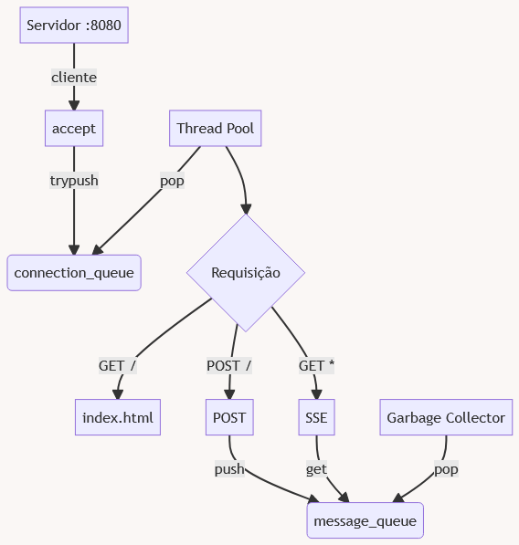

# Sincronização entre Processos

- Brenno Pereira Cordeiro
- 190127465

## Introdução

Muitos problemas envolvem a comunição de diversos agentes, sem exigir restrições
em como essa comunicação é realizada. Quando isso ocorre, o ideal, para manter
os requisitos é modelar uma solução com programação concorrente.

Uma das áreas que envolve problemas de comunição concorrente são servidores na
internet, como servidores HTTP. O protocolo HTTP é o principal protocolo em
atuação na Web, e permite que clientes conectados enviem informações e
requisitem recursos, como páginas HTML.

O protocolo HTTP é interessante pois há uma vasta disponibilidade de clientes,
desde os browsers tradicionais nos computadores, até geladeiras inteligentes.
O protocolo HTTP também disponibiliza várias funcionalidades, como os _Server
Sent Events_ [^1], que permitem que o servidor envie mensagens para clientes que
permanecem ouvindo na conexão.

## Problema

Um sistema de chat (mensagens instantâneas) via HTTP. Os usuário conseguem
acessar o sistema por meio de um navegador _Web_, como o _Google Chrome_, e são
capazes de enviar mensagens por meio de uma caixa de entrada de texto e enquanto
estão no _website_, irão receber mensagens enviadas pelos demais usuários.

Os usuários podem acessar o sistema concorrentemente para receber a página Web,
e por tanto, o serviço deve estar preparado para servir múltiplos usuários
concorrentemente. Os usuários também podem enviar mensagens concorrentemente, e
estarem prontos para receber mensagens ao mesmo tempo. O serviço deve considerar
todos esses casos e como atender uma quantidade desconhecida de clientes.


## Solução

Nosso servidor HTTP deve atender múltiplos clientes sobre a rede. Como HTTP
funciona sobre o protocolo TCP, iremos usar a biblioteca `socket` para lidar com
as conexões. O código consiste em básicamente pedir para o sistema operacional
para nos associar a uma porta TCP, e chamar a função `accept` no _socket_ aberto
para esperar uma conexão e nos entregar um descritor, que aponta para a conexão
recebida.

Para lidar com essas conexões concorrentemente, iremos criar uma _thread pool_,
ou um grupo de threads, que lidam com as conexões a medida que chegam.

### Fila Concorrente

Para resolver esse último problema, iremos usar uma fila concorrente. Uma fila
concorrente funciona assim como uma fila normal, porém suas operações utilizam
de locks e variáveis de condição para garantir que possa ser acessada por
múltiplas threads.

Como referência para implementação e projeto da API, foi utilizado a _Thread
Safe FIFO bounded queue_ [^2], disponível no projeto Apache Portable Runtime,
licenciado sobre a licença Apache License.

A implementação apresentada nesse projeto difere da referência, removendo partes
que não foram utilizadas e adicionando algumas funcionalidades para lidar com os
nossos problemas.

A fila implementada consiste basicamente de um array de ponteiros para guardar
os dados, um inteiro para guardar o próximo índice para inserção e outro para
guardar o próximo índice para remoção e alguns inteiros para lidar com os
limites. Além disso, nossa fila possui um _mutex_ para criar regiões de exclusão
mútua e duas variáveis de condição, para indicar se a fila deixou de estar vazia
ou deixou de estar cheia.

### Operações

```c
void queue_push(queue_t *queue, void *element);
```

A operação _push_ tenta inserir um elemento na fila se há espaço, e se não há,
esperar a variável de condição _not_full_ ser sinalizada. Ao inserir, avisa
qualquer thread que possa estar esperando na variável de condição _not_empty_.

```c
int queue_trypush(queue_t *queue, void *element);
```

Alguma vezes, não precisamos esperar a fila liberar espaço, e queremos lidar com
isso imediatamente. Para isso, a função _trypush_ não entra em esperar se a fila
não possuir espaço, e retorna imediatamente com o valor -1.

```c
void queue_pop(queue_t *queue, void **element);
```

A operação _pop_ tenta remover um elemento da fila se estiver populada, e se
estiver vazia, espera na variável de condição _not_empty_. Se alguma operação de
_push_ ocorrer, será acordada para consumir o elemento inserido. Ao remover um
elemento, sinaliza qualquer thread que posso estar esperando na variável de
condição _not_full_.

```c
int queue_get(queue_t *queue, void **element, int *index, int timeout_sec);
```

Essa operação não está presente na referência e foi projetado para o nosso
problema. _get_ busca o elemento no _index_, mas não altera a estrutura da fila.
Além disso, essa operação não espera para sempre como o _pop_, mas tem um
limite, definido por `timeout_sec` para esperar, usando a função
`pthread_cond_timedwait`.

### Fluxo do Programa

O fluxo do servidor é bem simples, já que a maior parte do trabalho pesado é
executado pela fila. Primeiro esperamos conexões com a função `accept` e botamos
qualquer conexão recebida na fila `connection_queue`. Se não é possível inserir,
respondemos ao cliente que o servidor está sobrecarregado.

Nas threads criadas da _thread pool_ esperamos conexões chegarem tentando
remover da fila `connection_queue`. Para lidar com uma requisição, fazemos um
parsing básico para entender qual é o método, e qual é o caminho da requisição
HTTP.

Se for uma requisição "GET /", enviamos o arquivo `index.html` para o cliente.

Se for uma requisição "POST /", obtemos o corpo da requisição e o colocamos na
fila `message_queue`.

Se for uma requisição "GET \*", então enviamos o header `Content-Type:
text/event-stream` para indicar para o cliente que vamos iniciar uma sequência
de eventos, e em seguida, entramos em um loop esperando na fila `message_queue`.

Para evitar vazamentos de memória, criamos uma thread que espera na fila
`message_queue`, da um tempo para outras threads consumirem as mensagens, e em
seguida libera o espaço das mensagens removidas.



### Uso

Para rodar o programa, podemos usar o comando:

```bash
make run
```

O programa também pode ser compilado e executado da seguinte forma:

```bash
gcc -o http http.c queue.c -lpthread
./http
```

O servidor então escuta na porta :8080, e pode ser acessado por um navegador
pela URL [http://localhost:8080](http://localhost:8080), ou usando o IP da sua
máquina.

## Conclusão

Soluções _multithread_ são a resposta natural para problemas concorrentes, como
o problema apresentado. Como são muito comuns, as linguagens e sistema
operacional oferecem várias opções para ajudar. 

Porém, por não terem uma execução determinística, são mais difíceis de se lidar.
É bem comum criar condições de corrida e _deadlocks_ enquanto se programa uma
solução _multithread_, principalmente em linguagens baixo nível como C, onde
todo o gerenciamento das threads é feito pelo usuário.

O problema complica mais ainda quando lidamos com memória gerenciada pelo
usuário, como é o caso desse trabalho. Precisamos sempre estar atentos para não
utilizar espaços de memória que foram liberados em outra _thread_. No caso desse
trabalho, foi necessário adicionar uma _thread_ apenas para lidar com `free` de
mensagens.

Hoje em dia, lidar com esses problemas se torna cada vez mais fácil, a medida
que programadores e pesquisadores criam novas ferramentas para lidar com
concorrência. Linguagens como Go e Lua oferecem modelos concorrentes usando
_corrotinas_, e Javascript usa um loop de eventos para lidar com várias tarefas
ao mesmo tempo. Esses modelos tentam remover algumas das dificuldades dos
problemas concorrentes, sacrificando um pouco de performance.

## Referências

[^1]: https://developer.mozilla.org/en-US/docs/Web/API/Server-sent_events
[^2]: https://apr.apache.org/docs/apr-util/0.9/group__APR__Util__FIFO.html

- [Networking in C](https://youtu.be/esXw4bdaZkc)
